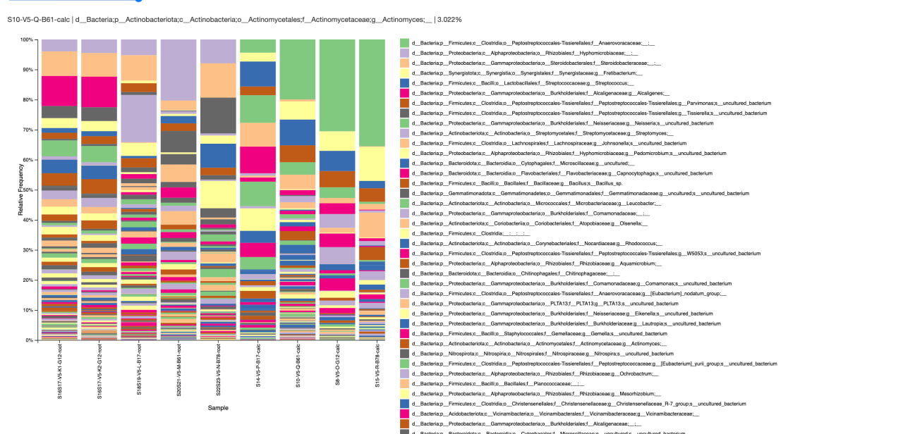
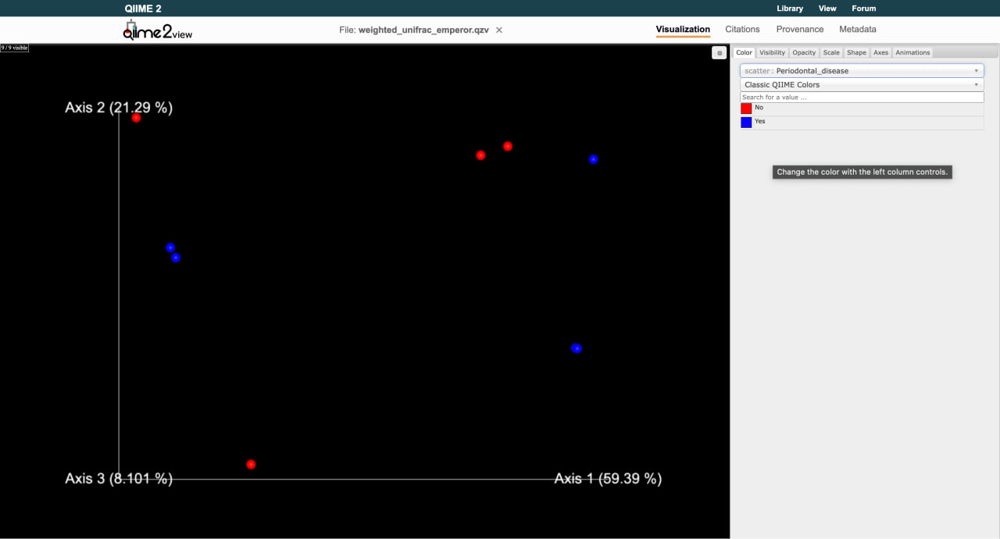

# Dead Man’s Teeth — Metagenomics Analysis

## Introduction

Metagenomics allows studying microbial communities directly from environmental DNA.
Two main approaches are commonly used:

- 16S rRNA amplicon sequencing
- Shotgun metagenomic sequencing

In this project we analyze ancient dental calculus samples from a medieval monastic site in Germany.
Dental calculus preserves microbial DNA for hundreds or even thousands of years and therefore provides a unique opportunity to study historical oral microbiomes.

The aim of this project is to characterize the microbial composition of ancient dental calculus samples and investigate the presence of oral pathogens using both amplicon-based and shotgun metagenomic approaches.

---

## Methods

### Dataset

Ancient dental calculus samples were sequenced targeting the V5 region of the 16S rRNA gene.

Raw sequencing data were obtained from the Figshare repository associated with the study.

### Tools

The following tools were used:

- QIIME2
- DADA2
- SILVA database
- Kraken2
- minimap2
- samtools
- bedtools

---

## Results

### Import of raw sequencing data into QIIME2

The raw 16S rRNA amplicon sequencing reads (single-end FASTQ files) were imported into QIIME2 for downstream analysis.

First, a **manifest file** was created to link each sample identifier with the absolute path to the corresponding FASTQ file. This file is required for importing demultiplexed sequencing reads into QIIME2.

Example commands used to generate the manifest file:

```bash
printf "sample-id\tabsolute-filepath\tdirection\n" > metadata/manifest.tsv

for f in data/raw/*.fastq; do
  name=$(basename "$f" .fastq)
  printf "%s\t%s/%s\tforward\n" "$name" "$PWD" "$f" >> metadata/manifest.tsv
done
```

The reads were then imported into QIIME2 using the manifest-based workflow for single-end FASTQ files:

```bash
qiime tools import \
  --type 'SampleData[SequencesWithQuality]' \
  --input-path metadata/manifest.tsv \
  --output-path data/processed/sequences.qza \
  --input-format SingleEndFastqManifestPhred33V2
```
The resulting artifact (`sequences.qza`) was validated to ensure the import was successful:

```bash
qiime tools validate data/processed/sequences.qza
```
To obtain an overview of sequencing depth and read quality across samples, a demultiplexing summary visualization was generated:

```bash
qiime demux summarize \
  --i-data data/processed/sequences.qza \
  --o-visualization results/sequences.qzv
```

The resulting file (`sequences.qzv`) contains an interactive summary of the dataset, including the number of reads per sample and the quality score distribution across read positions. These plots will be used to determine trimming parameters for the subsequent DADA2 denoising step.

### DADA2 denoising and ASV inference

After inspecting the read quality profiles, the sequencing data were processed using the DADA2 algorithm implemented in QIIME2. DADA2 performs several steps including quality filtering, error correction, chimera removal, and inference of amplicon sequence variants (ASVs).

Based on the quality profile obtained from the demultiplexing summary, the following parameters were selected:

- `--p-trim-left 35` — removal of the first 35 bases to eliminate primer sequences and low-quality leading bases
- `--p-trunc-len 140` — truncation of reads at position 140 to remove the low-quality tail of the reads

The denoising step was performed using the following command:

```bash
qiime dada2 denoise-single \
  --i-demultiplexed-seqs data/processed/sequences.qza \
  --p-trim-left 35 \
  --p-trunc-len 140 \
  --o-representative-sequences data/processed/rep-seqs.qza \
  --o-table data/processed/table.qza \
  --o-denoising-stats data/processed/stats.qza
```
This step produced three main outputs:

- `table.qza` — feature table containing ASV abundances across samples

- `rep-seqs.qza` — representative sequences for each inferred ASV

- `stats.qza` — statistics describing read retention during the denoising process

To inspect the denoising performance and the resulting ASV dataset, several visualizations were generated:


```bash
qiime metadata tabulate \
  --m-input-file data/processed/stats.qza \
  --o-visualization results/stats.qzv
```

```bash
qiime feature-table summarize \
  --i-table data/processed/table.qza \
  --o-visualization results/table.qzv \
  --m-sample-metadata-file metadata/sample-metadata.tsv
```

```bash
qiime feature-table tabulate-seqs \
  --i-data data/processed/rep-seqs.qza \
  --o-visualization results/rep-seqs.qzv
```

These visualizations allow evaluation of:

- the number of reads retained after denoising

- the distribution of ASVs across samples

- the sequences representing each inferred ASV

The resulting ASV table and representative sequences were then used for downstream taxonomic classification.

### Taxonomic classification of ASVs

Representative ASV sequences were taxonomically classified against the SILVA 138 reference database. Because the pre-trained Naive Bayes classifier was incompatible with the local scikit-learn version in the active QIIME2 environment, taxonomy assignment was performed using the `classify-consensus-vsearch` method.

The following command was used:

```bash
qiime feature-classifier classify-consensus-vsearch \
  --i-query data/processed/rep-seqs.qza \
  --i-reference-reads databases/silva-138-99-seqs.qza \
  --i-reference-taxonomy databases/silva-138-99-tax.qza \
  --p-threads 0 \
  --o-classification data/processed/taxonomy.qza \
  --o-search-results data/processed/search-results.qza
```

The resulting taxonomy assignments were summarized and visualized using:

```bash
qiime metadata tabulate \
  --m-input-file data/processed/taxonomy.qza \
  --o-visualization results/taxonomy.qzv

qiime taxa barplot \
  --i-table data/processed/table.qza \
  --i-taxonomy data/processed/taxonomy.qza \
  --m-metadata-file metadata/sample-metadata.tsv \
  --o-visualization results/taxa-bar-plots.qzv
```

Taxonomic composition of the samples was visualized with `qiime taxa barplot` using the ASV table and taxonomy assignments obtained with the SILVA 138 reference database.

At the highest taxonomic level, nearly all reads were assigned to the domain **Bacteria**, while only a very small fraction corresponded to **Archaea** or remained unassigned.

At deeper taxonomic levels, substantial variation in microbial composition was observed among the samples. The communities were highly heterogeneous, with different samples showing different dominant taxa and relative abundances.

At the genus/species level, several taxa commonly associated with the oral microbiome were detected, including **Actinomyces**, **Streptococcus**, **Neisseria**, **Gemella**, **Leptotrichia**, **Capnocytophaga**, and **Eikenella**. In addition, taxa relevant to periodontal disease were also present, including representatives of **Porphyromonas**, **Tannerella**, and **Treponema**.

These taxa are of particular interest because they include members of the so-called **red complex**, a group of bacteria strongly associated with periodontitis in modern oral microbiome studies. In the present dataset, these organisms were detected in the ancient dental material, supporting the idea that periodontal-associated bacteria were already present in historical human oral communities.

At the same time, many ASVs were assigned only to uncultured or partially resolved taxa (for example, “uncultured bacterium”), indicating limited taxonomic resolution for a fraction of the reads. Therefore, interpretation at the genus level is more reliable than at the species level for this dataset.


*Figure 1. Taxonomic composition of the analyzed ancient oral samples at taxonomic level 7 based on SILVA 138 classification and QIIME2 taxa barplot visualization.*

### Phylogenetic diversity and PCoA analysis

To investigate differences in microbial community composition between samples, 
phylogenetic diversity analysis was performed using the QIIME2 diversity pipeline.

First, representative ASV sequences were aligned using MAFFT and a phylogenetic 
tree was constructed with FastTree:

```bash
qiime phylogeny align-to-tree-mafft-fasttree \
  --i-sequences data/processed/rep-seqs.qza \
  --o-alignment data/processed/aligned-rep-seqs.qza \
  --o-masked-alignment data/processed/masked-aligned-rep-seqs.qza \
  --o-tree data/processed/unrooted-tree.qza \
  --o-rooted-tree data/processed/rooted-tree.qza
```

Based on the rooted phylogenetic tree and the ASV feature table, diversity metrics
were calculated using the `core-metrics-phylogenetic` pipeline:
```bash
qiime diversity core-metrics-phylogenetic \
  --i-phylogeny data/processed/rooted-tree.qza \
  --i-table data/processed/table.qza \
  --p-sampling-depth 3500 \
  --m-metadata-file metadata/sample-metadata.tsv \
  --output-dir results/core-metrics-results
```

This analysis produced several beta-diversity distance matrices, including
Unweighted UniFrac, Weighted UniFrac, Jaccard, and Bray–Curtis distances.
Principal Coordinate Analysis (PCoA) was then used to visualize differences
between microbial communities across samples.

The PCoA plot based on the Weighted UniFrac distance is shown in Figure 2.

The first principal coordinate explains approximately 59.4% of the variance
between samples, while the second coordinate explains 21.3%. Samples show
clear separation along the first axis, indicating differences in the relative
abundance of phylogenetically related taxa between individuals.

Samples labeled as having periodontal disease show partial clustering,
suggesting that disease status may influence the structure of the oral
microbial community.



*Figure 2. Principal Coordinate Analysis (PCoA) of microbial communities based on weighted UniFrac distance. Each point represents a sample, colored according to periodontal disease status.*


### Shotgun metagenomic profiling using Kraken2

To further characterize the microbial composition of the ancient dental calculus sample, shotgun sequencing reads were classified using the Kraken2 taxonomic classifier.

Kraken2 assigns reads to taxa by comparing k-mers from sequencing reads to a large reference database of microbial genomes. The classification results were summarized by counting the number of reads assigned to each taxon in the Kraken2 output file.


The analysis revealed that the dominant taxa in the sample were bacteria commonly associated with the human oral microbiome. Among the most abundant species were:

- Streptococcus sanguinis  
- Streptococcus gordonii  
- Arachnia propionica  
- Abiotrophia defectiva  
- Lautropia mirabilis  
- Actinomyces species  
- Neisseria species  
- Capnocytophaga species  

These organisms are typical members of dental plaque and oral biofilm communities.

Importantly, the pathogen **Tannerella forsythia**, a member of the periodontal **red complex**, was also detected in the sample. The presence of this organism supports previous evidence that periodontal pathogens were present in the oral microbiome of ancient human populations.

Overall, the shotgun sequencing results are consistent with the 16S rRNA amplicon analysis, which also identified several oral-associated genera including Streptococcus, Neisseria, Capnocytophaga, and Actinomyces.

### Comparison with the modern *Tannerella forsythia* genome

To investigate potential genomic differences between the ancient and modern strains, the assembled contigs were aligned against the complete genome of *Tannerella forsythia* (GenBank accession NC_016610.1).

The alignment was performed using `minimap2`, and the resulting SAM file was converted to a sorted and indexed BAM file with `samtools`. Alignment coordinates were converted to BED format using `bedtools`. Genome regions of the modern reference not covered by ancient contigs were identified by intersecting the alignment with the reference genome annotation.

Example commands used in the analysis:

```bash
minimap2 -ax asm5 \
  data/reference/t_forsythia.fasta \
  data/shotgun/G12_assembly.fna \
  > results/t_forsythia_alignment.sam

samtools view -bS results/t_forsythia_alignment.sam > results/t_forsythia_alignment.bam
samtools sort results/t_forsythia_alignment.bam -o results/t_forsythia_alignment_sorted.bam
samtools index results/t_forsythia_alignment_sorted.bam

bedtools bamtobed -i results/t_forsythia_alignment_sorted.bam > results/alignment.bed

bedtools intersect \
  -a data/reference/t_forsythia.gff3 \
  -b results/alignment.bed \
  -v > results/missing_genes.gff3
```
In total, **956 genes and 964 coding sequences (CDS)** from the modern reference genome were not intersected by the ancient assembly contigs.

Among the uncovered genes were proteins involved in transport and membrane processes (ABC transporters, MFS transporters), fatty acid biosynthesis enzymes, nucleotide metabolism enzymes, RNA modification proteins, as well as several hypothetical proteins and mobile genetic element–related proteins such as transposases.

Examples of such genes include:

- beta-ketoacyl-ACP synthase family protein
- ABC transporter ATP-binding protein
- dihydroorotate dehydrogenase electron transfer subunit
- tRNA pseudouridine synthase TruA
- MFS transporter
- IS1595 family transposase

Because the ancient assembly is fragmented and derived from metagenomic sequencing, these uncovered regions likely reflect a combination of incomplete assembly, uneven coverage, and possible genomic differences between ancient and modern T. forsythia strains.


---

## Discussion

The analysis of ancient dental calculus samples revealed a complex microbial community consistent with the oral microbiome. Amplicon-based profiling using QIIME2 demonstrated the presence of multiple bacterial taxa commonly associated with the human oral cavity. Beta-diversity analysis using weighted UniFrac and PCoA showed clear differences in community composition between samples, indicating variability in microbial structure within the dataset.

Taxonomic classification of shotgun reads using Kraken2 further supported these observations. The most abundant taxa included members of genera such as *Streptococcus*, *Actinomyces*, *Neisseria*, and *Capnocytophaga*, which are well-known components of the human oral microbiome. Several taxa associated with periodontal disease, including *Tannerella forsythia*, were also detected. The presence of these organisms in ancient dental calculus is consistent with previous studies demonstrating that oral pathogens have long been part of the human oral microbial community.

To further explore the genomic content of *Tannerella forsythia*, assembled contigs from the ancient metagenomic dataset were aligned to the complete modern reference genome. Regions of the modern genome not covered by ancient contigs were identified using bedtools. Several genes related to membrane transport, metabolic processes, and RNA modification were not intersected by the ancient assembly. However, because the ancient assembly is fragmented and derived from metagenomic data, the absence of these genes cannot be interpreted as definitive gene loss. Instead, these results likely reflect a combination of incomplete genome recovery, uneven sequencing coverage, and possible evolutionary differences between ancient and modern strains.

Overall, the results demonstrate that ancient dental calculus preserves a rich record of the oral microbiome and can be used to investigate the presence and genomic characteristics of oral pathogens. Combining amplicon sequencing, shotgun metagenomics, and comparative genomics provides complementary insights into the composition and potential functional diversity of ancient microbial communities.